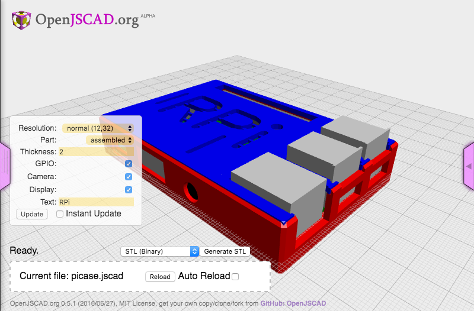
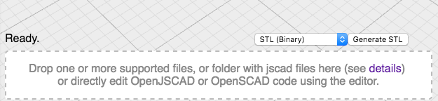

# picase

> A slim case for a Raspberry Pi B+

This is an example project that will create a slim case for a RaspberryPi. It uses [openjscad.org](http://openjscad.org) and [jscad-rasberrypi](https://github.com/johnwebbcole/jscad-raspberrypi) to create the case. You can customize the case with the on screen parameters. The project was started using the [Yeoman Jscad Generator](https://github.com/johnwebbcole/generator-jscad)

Here is a [live example](http://openjscad.org/#https://raw.githubusercontent.com/johnwebbcole/picase/master/dist/picase.jscad).

## Installation

You need to have [Node.js](https://nodejs.org) and [gulpjs](http://gulpjs.com/) installed. Clone this repository and run `npm install` then `gulp`. Then drage the `dist/picase.jscad` file into drag and drop area of [openjscad.org](http://openjscad.org).

## Running

The jscad project `picase` uses gulp to create a `dist/picase.jscad` file and watches your source for changes. You can drag the `dist/picase.jscad` directory into the drop area on [openjscad.org](http://openjscad.org). Make sure you check `Auto Reload` and any time you save, gulp will recreate the `dist/picase.jscad` file and your model should refresh.

## License

ISC © [John Cole](http://github.com/)
